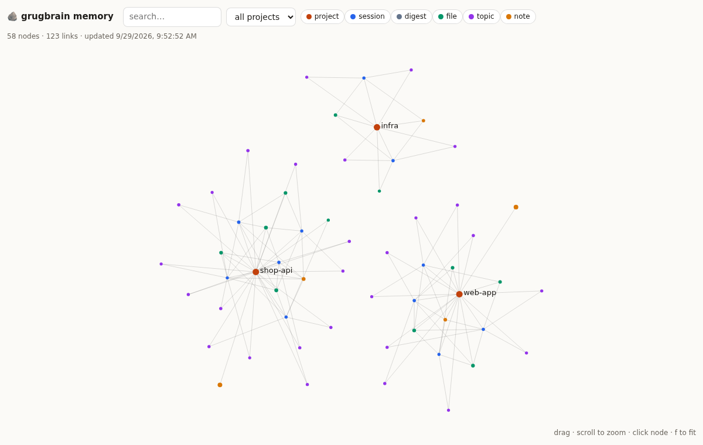

# 🪨 grugbrain

> why use many token when few token do trick

**grug make Claude use few token. grug remember for Claude. grug do alone. you do nothing.**

Install once. grug sit between Claude Code and Anthropic API, trim fat, stick cache, guard big files, remember every session in small brain that never get fat. grug draw brain picture. grug write Obsidian notes. grug show cave dashboard.

```bash
npx github:swaraj792725/grugbrain install
```

That's it: one line, straight from GitHub (needs `git`, which every Mac with Xcode command-line tools has). No version needed: npx checks GitHub every run and always installs the newest version. It puts the `grug` command on your PATH. Later updates: `grug update`.

Pin an exact release instead:

```bash
npx --yes --package=https://github.com/swaraj792725/grugbrain/releases/download/v2.2.0/grugbrain-2.2.0.tgz grugbrain install
```

> From npm (`npm install -g grugbrain && grug install`) once the package is live on npmjs.com; until then the npm registry answers 404.

Restart Claude Code (and Claude Desktop). New terminal → `grug doctor`. Done. Grug work now. Forever. No reminders.

> Old `@swaraj792725/token-diet` (GitHub Packages, v1) is **discontinued**. It was the Desktop-only prototype. Use `grugbrain`.

---

## grug see problem

Claude burn token on:

| fat | how much | what grug do |
|---|---|---|
| same big prompt sent every turn, no cache | pay 100% each turn | **cache autopilot**: add cache breakpoints when app forget. Cache read cost 0.1×. |
| giant `npm test` / log / build output | 10k–100k token each | **trim**: strip colour junk, squash repeat lines (`[×50]`), keep head + tail + problem lines, save the full original and say where |
| same tool output twice in one chat | pay twice | **dedupe**: second copy become pointer to first |
| 400 passing tests + 1 failure dumped into chat | 5–50k token | **test summarizer**: keep every failure (assertion, diff, code frame) + summary, drop passing noise. jest, vitest, mocha, pytest, go, cargo, TAP, rspec, phpunit, tsc |
| `Read` whole 5,000-line file to find one function | ~30k token | **read guard**: say "grep first, read range". Ranged read always allowed. |
| `Read` same unchanged file again | pay again | Claude Code ≥ 2.1 already stub this itself (grug bench found it). grug's **re-read guard** stay off by default; turn on for older versions: `grug config set rereadGuard.enabled true` |
| prompt cache silently broken (timestamp in system prompt, tool list change, model switch) | pay 2× cache write every turn | **cache-miss detective**: name culprit + tokens wasted in dashboard |
| exploring repo file by file | 20–60k token | **repo map / outline / read_symbol** MCP tools: signatures, not bodies |
| Claude chatty: preamble, recap, "let me know!" | output cost 5× input | **terse mode**: short answer. `full` = caveman talk. Code never shortened. |
| every new session re-learn project from zero | many turn, many token | **memory**: small brief at start, recall on prompt, fixed budget |

grug **prove** it too: `grug bench` run real Claude Code twice per task (grug off vs on), check answer with real test, show quality + cost side by side. Savings that hurt quality get caught.

grug **measure**, not guess. Proxy read real `usage` from every API reply (input, output, cache read, cache write). Dashboard show real dollars. Things grug can only estimate (trim, read guard) say *estimate* on label.

---

## grug keep context small (automatic)

Long session = big context = every reply re-read all of it. Real install: **~500k tokens re-read per reply.** Tool can't press `/clear` for you (Claude Code don't allow). But Claude Code can compact itself, and grug decide *when*:

1. grug set Claude Code's auto-compact point to **200k** (not near 1M). No user action.
2. Right before compaction: grug save a **handoff**: goal, latest asks, open todos, where it got to, files changed, recent commands. No AI call, no tokens.
3. Right after: grug put the handoff into the fresh context, and tell Claude about the **`history` tool**: search the full old conversation for an exact detail instead of guessing or carrying it.
4. You type `/clear` yourself when switching tasks? Same handoff, next session pick up.

Real Claude Code run: auto-compaction fired by itself → 120-token handoff restored → answer that needed pre-compaction content still correct → later replies ~40k tokens instead of 100k+.

```bash
grug config set autoCompact.windowTokens 300000   # compact later (100k–1M), 0 = Claude Code default
grug config set routing.subagentModel sonnet      # subagents on Sonnet 5.5, main chat stays on your model
```

## grug brain (memory that never get fat)

Normal memory file grow, grow, grow. Every session pay for all of it. Bad.

grug brain is **graph**: projects · sessions · files · topics · notes · digests.

- **auto capture**: hooks log prompts, files touched, commands, final answer. You type `remember: we deploy with fly.io` → pinned note.
- **auto notes**: grug pick sentences like "root cause was…", "decided…", "never…" from Claude's last answer.
- **decay**: every node lose score over time (half-life 14 days) unless used again.
- **fold**: sessions older than 21 days squash into one monthly **digest** per project. Old buffers deleted.
- **merge**: near-same notes become one note.
- **cap**: max 400 nodes per project; weakest go first. Pinned notes stay.
- **budget**: session brief ≤ 700 token, per-prompt recall ≤ 250 token, and only when something clearly match. Already-said things not repeated.

So: day 1 or day 300, context cost per session stay **flat**. Knowledge carry forward. That the multiplier.

```text
[grugbrain memory: shop-api, 23 past session(s). Auto-maintained; trust but verify against the code.]
Last session (2h ago): "fix the stripe webhook retries"
  ended with: Root cause was a missing await in src/stripe/webhook.ts; fixed by awaiting before commit.
Remembered:
- Never call Stripe from a DB transaction; enqueue instead
Hot files: src/checkout.ts, src/stripe/webhook.ts, src/orders.ts
```

### grug draw brain

```bash
grug graph
```

Open interactive graph (one HTML file, no internet): drag, zoom, search, filter by project/type, click node for detail. Auto-redrawn after each session at `~/.grug/graph.html`.



### grug write Obsidian

Brain also written as markdown with `[[wikilinks]]` + frontmatter at `~/.grug/vault/grugbrain/`. Open in Obsidian → *Open folder as vault*. Graph view just work.

Want it inside your own vault?

```bash
grug config set memory.vaultDir ~/Documents/MyVault
```

grug only write in `MyVault/grugbrain/` and only delete files grug made (they carry `generator: grugbrain`). Your notes safe.

---

## grug cave dashboard

```bash
grug dash
```

```text
 🪨 grugbrain v2.0.0   proxy ● up :4747  hooks ✓  code-mcp ✓  desktop ✓  terse lite
 1 Overview  2 Activity  3 Memory  4 Advice                                    10:42:07
────────────────────────────────────────────────────────────────────────────────────
MEASURED  real API usage through the proxy
                                         24h      7 days    all time
  requests                                84         612       2,410
  spend                                $3.12      $21.40      $88.10
  saved by prompt cache (all)          $9.80      $61.22     $240.51
    …where grug added the cache        $0.00       $1.10       $6.40
  cache hit rate (7d)           ███████████████████░░░░░ 79%

WHAT GRUG DID  (token counts here are estimates)
  trimmed long tool output          ~412k tok       96×
  deduped repeated tool results     —               14×
  redirected huge full-file reads   ~188k tok       11×
  outlines instead of full files    ~61k tok        40×
  memory briefs + recalls (cost)    -9.8k tok       57×  context carried over
14-DAY  spend ▂▃▅▂▁▇▃▄▅▃▂▆▄▃   cache-saved ▃▄▆▃▂█▄▅▆▄▃▇▅▄
PROJECTION  at 7-day pace: $91.71/mo, without grug's changes ≈ $104.20/mo
```

- **1 Overview**: what grug did (measured + estimated), 14-day sparkline, monthly projection
- **2 Activity**: live log of every action (trim, guard, cache, brief, recall, fold…)
- **3 Memory**: projects, sessions, digests, notes, hot files, graph + vault paths (`g` opens graph)
- **4 Advice**: what grug *would* do but can't do alone: low cache hit rate, too much top-tier model spend (with $ estimate), terse mode, broken install

`grug dash --once` print it all without the TUI (for scripts / CI).

---

## grug prove it (`grug bench`)

```bash
grug bench --model sonnet --runs 3 --yes
```

Makes small real repos (failing test to fix, needle in huge log, value hidden in multi-file repo, re-read trap), runs `claude -p` on each with grug **off** (hooks disabled, proxy raw pass-through) and **on**. Warm-up first + alternating order so prompt cache timing can't fake savings. Every task graded by a real check (tests pass / exact answer).

Real run (Claude Code 2.1.284, Haiku 4.5, 4 tasks × 2 runs × 2 arms, warm cache both arms):

| task | what it test | quality off → on | cost off → on | uncached input off → on |
|---|---|---|---|---|
| fix-failing-test | test summarizer | 2/2 → 2/2 | $0.108 → $0.071 (**−35%**) | 27.5k → 10.5k (**−62%**) |
| log-needle | read guard | 2/2 → 2/2 | $0.061 → $0.062 (same) | 8.6k → 8.8k |
| find-threshold | navigation | 2/2 → 2/2 | $0.047 → $0.047 (same) | 8.5k → 8.6k |
| reread-config | re-read | 2/2 → 2/2 | $0.102 → $0.103 (same) | 37.0k → 37.3k |
| **total** | | **8/8 → 8/8** | **$0.318 → $0.282 (−11%)** | **−20%** |

Grug read it straight: big win where output is noisy (tests, builds, logs), no loss anywhere, no magic where Claude Code already efficient. Most of each small task's cost is Claude Code's own ~35k-token system prompt, already cached. Bench spends real usage, so it asks for `--yes`; use `--runs 3+` for your own numbers.

## where grug work

| app | what grug do |
|---|---|
| **Claude Code in a terminal / IDE** | everything: proxy (cache, trim, dedupe, real stats), hooks (memory, read guard, test summaries, terse), MCP tools |
| **Claude app → Code tab** | hooks (memory, read guard, test summaries, trimming, terse) + real usage measured from session transcripts. The app manages its own API connection, so the proxy isn't in its path |
| **Claude Desktop** chat | MCP tools (`outline`, `read_symbol`, `repo_map`, `search`, `recall`, `remember`, `project_brief`…) + shared memory. Desktop's own API calls are private, so no proxy, no measured stats. |
| **claude.ai** in browser | nothing. grug cannot reach inside browser. grug honest. |
| your own app on the Anthropic SDK | set `ANTHROPIC_BASE_URL=http://127.0.0.1:4747` → proxy + stats |

Pro/Max subscription or API key: both fine. Proxy pass auth headers through untouched. On a subscription you are limited by usage, not billed per token, so "$" in dashboard mean *API-equivalent value*. Fewer token still mean you hit limits later.

---

## grug safety rules

- **fail open**: transform throw → original request sent. Upstream say 400 to optimized request → grug resend original untouched, log `fallback`.
- **deterministic**: same conversation → same bytes → cache prefix stay stable.
- **never touch** assistant turns or thinking blocks. Never add cache breakpoints when app already manage cache (Claude Code does).
- **file reads never trimmed**: Claude asked for that content.
- **config safety**: every file backed up to `~/.grug/backups/` first. Broken JSON config? grug **refuse to write** and tell you. Writes atomic.
- **absolute paths**: Mac GUI apps don't see your shell `PATH`; grug use full node path.
- **keep your gateway**: already have `ANTHROPIC_BASE_URL`? grug chain to it, restore it on uninstall.
- **always alive**: launchd (macOS) / systemd `--user` (Linux) keep daemon up; SessionStart hook restart it if needed. `grug doctor` check all.
- **local only**: no telemetry. Data live in `~/.grug`.

---

## grug commands

```text
grug install [--no-proxy] [--no-desktop] [--no-code] [--no-service]
grug dash [--once]              TUI dashboard
grug doctor                     check everything, say how to fix
grug uninstall [--purge]        remove (keeps memory unless --purge)

grug graph                      open memory graph
grug vault                      rebuild Obsidian vault, print path
grug brief [dir]                what grug would tell Claude about a project
grug recall <query>             search memory
grug remember <text>            pin note for current project
grug maintain                   ingest + consolidate now (normally automatic)

grug map [dir] [--budget 1500]  ranked repo map under token budget
grug outline <file>             skeleton of a source file
grug compress <text | ->        strip filler from text you'll reuse (e.g. system prompt)

grug config                     show config
grug config set <key> <value>   e.g. terse full · readGuard.maxBytes 100000 · memory.briefTokens 500
grug savings                    one-line summary
```

## grug remember for Claude (auto-recall + code graph)

Small context still need good memory, or quality drop. So grug feed Claude the right bit at the right time. All automatic, hooks fail open and stay fast.

- **auto-recall**: every prompt, grug search memory notes, code graph, and old conversations. Only clear matches go in, max **800 token**, labelled "possibly relevant, verify before relying". Memory first (decisions, root causes, your rules), then code spots, then old-session excerpts. "ok", "yes", short prompts: grug say nothing. Same thing never twice in a session. Current session never searched (already in context).
- **graph-first code**: session start give Claude a small repo map (~600 token) and say: find with `search` / `repo_map` / `outline`, read with `read_symbol` / `read_lines`, full-file Read last. Per prompt grug also name the few files and symbols that match, with line ranges. No bodies.
- **better history search**: rare words count more (BM25-style), your asks and decisions count more, parsed transcripts cached by mtime.
- **grug take notes by himself**: when session compact or end, grug pull decisions, root causes, your "always/never" rules, and commands that worked from transcript. No AI call. Secrets skipped. Merge, decay, cap 60 per project: no pile-up.
- **session budget**: everything grug inject stay in context and get re-read each reply. So recall has total budget per session (2500 token). Budget fill up, bar go up. Budget gone, grug quiet. Compaction reset it.
- **grug learn what help**: after a code hint, did Claude open that file? Hint mostly ignored, grug get pickier. Mostly used, grug relax. Small steps, bounded, self-adjusting.
- **fresh map**: file Claude just wrote is found at once, and graph rescan quietly in background.
- **notes as you go**: grug read only new transcript bytes at each stop, so early decisions in very long session not lost.
- **grug understand other words**: "authentication" finds the note that say "login". Small groups of dev words (~30), half-credit, same strict gate. Long prompt with many asks: grug also try each ask alone.
- **cold cache warning**: come back to big session after cache expired, next reply pay 10-20x to re-read everything. grug tell you (you only, not Claude) and have handoff ready. Switching task? `/clear`.
- `grug dash` and `grug doctor` show how many injections, average token cost, and how often hints got used.

```bash
grug config set autoRecall.maxTokens 500      # smaller recall block (100-4000)
grug config set autoRecall.enabled false      # no recall
grug config set graphContext.enabled false    # no code map / code hints
```

## grug and pictures (screenshots, images, PDFs, video)

One picture is cheap (~1.5k token max). The trouble: every picture stays in context and get re-read each reply. 40 screenshots = ~60k token, forever. So grug:

- **skip same screenshot twice**: nothing clicked, edited, or run since last one? Same picture, already in context. Grug say no, once. Ask again, it go through. Click something, next screenshot fine.
- **one hint** first screenshot: for page state use text snapshot; screenshot only to check how it looks.
- **skip same image re-read** if file unchanged and still in context.
- **shrink big image files** before reading (default long edge 1200px, PNG done by grug himself, others via `sips`/ImageMagick if there). Original untouched. Repeat the Read for full size.
- **PDF text first**: `pdf_text` tool (needs `pdftotext`, comes with poppler) gives text cheap and says which pages are scans/figures, read those as images.
- **video**: `video_frames` gives one sheet of many frames = one image cost. Needs ffmpeg.
- **`media_info`**: what will this file cost, best way to look.
- **pile-up notice** to you (not Claude) when images in context pass 20k token.

```bash
grug config set mediaGuard.imageMaxEdge 1600   # shrink less (512-4096), 0 = never shrink
grug config set mediaGuard.dedupeScreenshots false
grug config set mediaGuard.pdfPages 8          # allow bigger PDF page reads before the text hint
```

## grug make Claude use grug first (and clear when done)

Grug push memory and map into context, but Claude decide what to do next. So grug also nudge at the moment Claude is about to search or read:

- **Grep a symbol** grug know? Note rides along: "`foo` is at src/orders.ts L722-728". Next step is a small ranged Read, not whole file.
- **Whole-file Read** of a mid-size code file? Grug ask once: Grep first, or Read with offset/limit (Edit is happy with that too). Repeat the Read and it goes through. Files you are editing: never asked.
- Hints say **ranged Read**, not MCP tools: MCP tools load lazily and cost extra turns. Live test: edit task cost 55% less, context 31% less, edit still right.
- **Brief tells Claude**: check these notes and the map before re-exploring.
- **Adoption count** in `grug dash`: did Claude use grug tools, or just Read/Grep? Were hints followed?
- **New task + big context?** Grug tell you (not Claude): `/clear` now. Same work? Ignore.
- **`grug context`**: what fills this session: your messages, Claude text, tool results per tool, images, and the biggest items. The size alert names top consumers too.

```bash
grug context                                   # what is filling the current session
grug config set graphContext.readHintBytes 20000   # ask about full reads only above 20 KB (0 = never)
grug config set taskBoundary.enabled false     # no new-task /clear suggestions
```

### config grug understand

| key | default | what |
|---|---|---|
| `terse` | `lite` | `off` · `lite` (concise) · `full` (caveman talk) |
| `port` | `4747` | proxy port |
| `upstream` | `https://api.anthropic.com` | where proxy forward to |
| `proxy.autoCache` | `true` | add cache breakpoints when client set none |
| `proxy.trimToolResults` | `true` | trim giant tool output |
| `proxy.dedupeReads` | `true` | replace repeated identical tool outputs |
| `proxy.trimThresholdChars` | `24000` | trim only above this |
| `readGuard.enabled` / `maxBytes` | `true` / `60000` | redirect full reads of bigger files |
| `rereadGuard.enabled` / `windowMinutes` | `true` / `45` | skip unchanged re-reads (once) |
| `testSummary.enabled` / `minChars` | `true` / `3000` | collapse test/build output |
| `updateCheck` | `true` | GitHub release check every 6h, notify only |
| `contextAlert.enabled` / `firstTokens` | `true` / `150000` | one-line notice when context passes 150k, 300k, 600k… |
| `handoff.enabled` / `maxTokens` / `maxAgeHours` | `true` / `1200` / `48` | carry work across compaction, `/clear` and new sessions |
| `autoCompact.windowTokens` | `200000` | where Claude Code auto-compacts (100k–1M; 0 = its default) |
| `routing.subagentModel` | `''` | `sonnet` / `haiku` / `opus` / `inherit` for subagents |
| `graphContext.hints` / `readHintBytes` | `true` / `12000` | tool-time hints: symbol location on Grep, outline-first on mid-size full Reads |
| `taskBoundary.enabled` / `minTokens` | `true` / `60000` | suggest `/clear` (to you) when a new task starts on a big context |
| `mediaGuard.enabled` | `true` | screenshots / images / PDFs / video rules |
| `mediaGuard.dedupeScreenshots` / `dedupeImageReads` / `guidance` | `true` | skip repeats, one-time hint |
| `mediaGuard.imageMaxEdge` | `1200` | shrink image files longer than this (px); 0 = never |
| `mediaGuard.pdfPages` / `imageAlertTokens` | `4` / `20000` | PDF text-first threshold; image pile-up notice |
| `idleAlert.enabled` / `minExtraUsd` | `true` / `0.25` | warn (you only) when idle cache expiry makes next reply expensive |
| `autoRecall.enabled` / `maxTokens` / `sessionTokens` | `true` / `800` / `2500` | per-prompt recall from memory, code graph, old sessions; total cap per session |
| `graphContext.enabled` / `mapTokens` | `true` / `600` | repo map at session start + code hints per prompt |
| `memory.enabled` | `true` | memory capture + brief + recall |
| `memory.briefTokens` / `recallTokens` | `700` / `250` | hard budgets |
| `memory.halfLifeDays` / `foldAfterDays` / `maxNodesPerProject` | `14` / `21` / `400` | how grug forget |
| `memory.vaultDir` | `~/.grug/vault` | Obsidian output |

---

## grug versions live on GitHub

- Every release = git tag `vX.Y.Z` + GitHub Release with installable tarball + notes from `CHANGELOG.md`.
- `grug update` installs the newest release (`grug update --check` only looks). The background service checks GitHub every 6 hours; when a new version exists, `grug dash`, `grug doctor` and a one-line notice at the start of each Claude Code session tell you. Grug never installs on its own.
- Install exact version:

```bash
npx --yes github:swaraj792725/grugbrain#v2.2.0 install        # a release tag
npx --yes --package=https://github.com/swaraj792725/grugbrain/releases/download/v2.2.0/grugbrain-2.2.0.tgz grugbrain install   # the release file
npm install -g grugbrain@2.2.0 && grug install                 # npm, once published there
```

Maintainer: `npm run release:patch` (or `release:minor`), add a `## x.y.z` section to `CHANGELOG.md`, merge to `main`. Workflow `release.yml` tag, build, test, attach tarball, create GitHub Release, and publish to npm if `NPM_TOKEN` secret exist.

## grug honest about limits

- Claude Code already cache well. There grug's cache autopilot mostly idle; real wins are trim, read guard, memory, terse, advice. Dashboard split "cache saved (all)" from "where grug added cache" so grug not steal credit.
- Memory notes come from rules, not an LLM. Good at "what files, what asked, how it ended, what you told it to remember". Not perfect summaries. Zero extra API cost.
- Trim and read-guard savings are estimates (chars ÷ ~3.6). Cache savings and spend are real numbers from the API.
- Model routing (Opus → Sonnet/Haiku) is advice only. grug never switch your model behind your back.

---

## grug go away (uninstall)

```bash
grug uninstall          # remove hooks, proxy, MCP, launchd, `grug` command; restore settings; keep memory
grug uninstall --purge  # same + delete ~/.grug (memory, stats, vault)
npm uninstall -g grugbrain   # if installed with npm -g
```

## for the grug who publish (maintainer)

`E404 Not Found - GET https://registry.npmjs.org/...` mean package never published to public npm (old setup pushed to GitHub Packages, which `npx` don't read). Fix:

1. Make npm account → create **Automation** access token.
2. GitHub repo → Settings → Secrets → Actions → add `NPM_TOKEN`.
3. Bump the version and merge to `main` (see "grug versions live on GitHub"). `release.yml` publishes to npm with provenance once `NPM_TOKEN` exists.

Or by hand: `npm login && npm publish --access public`.

Dev:

```bash
npm install
npm test          # vitest, sandboxed HOME, never touch your real config
npm run typecheck
npm run build     # dist/cli.js is one self-contained file
```

MIT © swaraj792725
